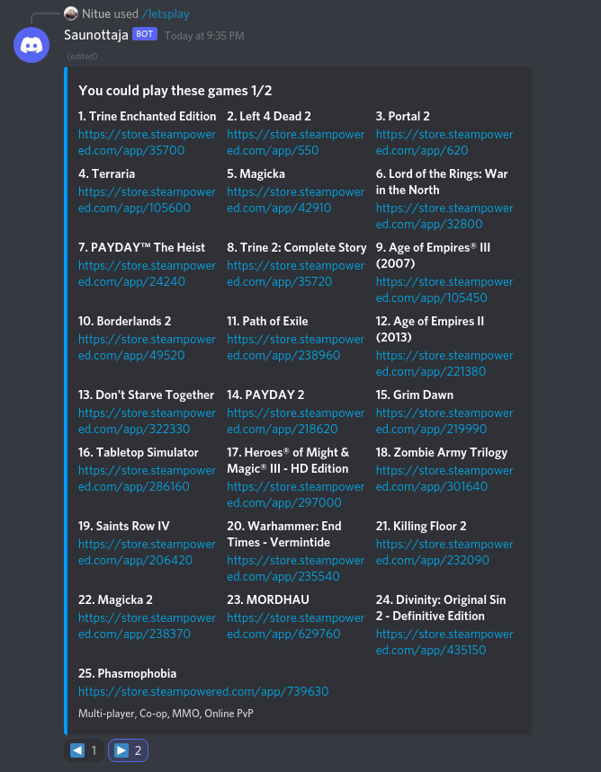

# Saunottaja Discord Bot

Saunottaja is a Discord bot which can find out what Steam games you and your friends could play together.



# What can it do?

1. `@Saunottaja letsplay @You @YourFriend @YourAnotherFriend` will list all games you can play with the mentioned users.
2. `@Saunottaja letsplay random @You @YourFriend @YourAnotherFriend` will suggest a random game you can play with tagged users.
3. `@Saunottaja steamid 123123` will register `123123` to as your Steam ID for previously listed commands to work.
4. Mentioning `@Saunottaja` without recognized command will print the instructions for all commands.

# Things to do

1. Find out games on Steam wishlists
2. AWS CDK for AWS deployment (?)
3. Find out which Windows games are playable via SteamPlay on Linux
4. Add unit tests

# Known issues and limitations

1. Steam API has limit of 100000 requests per day. 
2. Some APIs also have a limit for frequent requests which renews in few minutes after `HTTP 429` is given.
   
For these reasons, the **bot is currently only suitable for small servers where constant usage is not needed**. Additionally, usage on multiple servers is not suitable for these reasons. 

# Development

You can also follow these instructions for running the bot locally, but the used image is not optimized for production usage.

## Prerequisites

1. Create an application on the [Discord Developer Portal](https://discord.com/developers/applications) and add a bot to your application. Take a note of your bot token.
2. Get your [Steam API key](https://steamcommunity.com/dev/apikey).

Note: API keys and tokens are private information, and you should never share these with anyone.

3. Install [Docker](https://www.docker.com/).
4. Install Node 14.x (or later). Not *required* but recommended.

## Setup

Create `.env` file and set values like in the `.env.example` file. Paste your Steam API key and Discord bot token here.

Launch the application with compose:

```shell
$ docker-compose up -d
```

Editing files in `src` folder should trigger building and restarting of the application automatically.

For intellisense to work in your editor, node modules are needed:

```shell
$ npm install
```

# Running in production